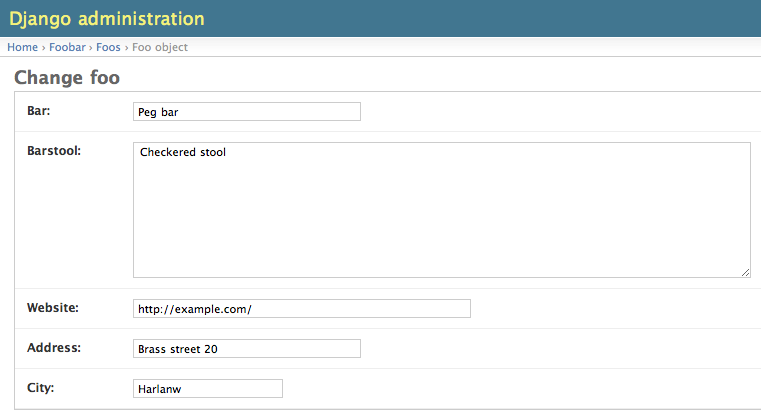

Internationalization and localization of django models, with admin support
==========================================================================

At times it becomes a requirement to translate models. Django supports 
internationalization of static text in templates and code by means of gettext.
For translation of models - dynamic data - easymode offers simple decorators to
enable internationalized model fields and localized admin classes.

.. _internationalization_of_models:

Internationalization of models
------------------------------

.. note::

    There is one requirement models fields have to satisfy to be able to be
    internationalised by easymode. Their 
    :func:`~django.db.models.to_python` method may not access ``self``.

suppose we have the following model.

::
    
    from django.db import models

    class Foo(models.Model):
        bar = models.CharField(max_length=255, unique=True)
        barstool = models.TextField(max_length=4)
        website = models.URLField()
        address = models.CharField(max_length=32)
        city = models.CharField(max_length=40)

In different languages the city could have a different name, so we would like to 
make it translatable (eg. internationalize the city field). This can be done using
the :class:`~easymode.i18n.decorators.I18n` decorator. Decorating the model as 
follows makes the city field translatable::

    from django.db import models
    from easymode.i18n.decorators import I18n

    @I18n('city')
    class Foo(models.Model):
        bar = models.CharField(max_length=255, unique=True)
        barstool = models.TextField(max_length=4)
        website = models.URLField()
        address = models.CharField(max_length=32)
        city = models.CharField(max_length=40)
    
Now the ``city`` field is made translatable. As soon as you register this model 
with the admin, you will notice this fact. Depending on how many languages you got
in ``LANGUAGES`` this is how your change view will look:

.. image:: non-localized.png

While useful, the interface can become very cluttered when more fields need to
be internationalized. To make the interface less cluttered the admin class that
belongs to the model, can be *Localized* making it show only the fields in the
current language.

.. _localization_of_admin:

Localization of models in django admin
--------------------------------------

As there are several options to register a model for inclusion in django's admin,
there are also several options to localize the admin classes.

The simplest way to make a model editable in the admin is::

    from django.contrib import admin
    from foobar.models import Foo

    admin.site.register(Foo)

Since the admin class is implicit here, there is no way we can localize the
admin class this way. The next simplest way is::

    from django.contrib import admin
    from foobar.models import Foo

    admin.site.register(Foo, models.ModelAdmin)

Here the admin class is explicit, so we can modify it. The way this is done is by
using the :class:`~easymode.i18n.admin.decorators.L10n` class decorator::

    from django.contrib import admin
    from easymode.i18n.admin.decorators import L10n
    from foobar.models import Foo

    admin.site.register(Foo, L10n(Foo, models.ModelAdmin))

Note that the decorator needs the model to determine which fields are localized, so
it must be passed as a parameter. Now the change view in the admin looks as follows:

All the 'city' fields are hidden, except for the field in the current language. Note
That all fields which can be translated are marked with ∴ . To edit the content for 
the other languages, the current language must be switched. Please refer to 
:ref:`translation_of_contents` for more details.

There is one more way a models can be registered for the admin and that is by creating
a new descendant of :class:`~django.contrib.admin.ModelAdmin` for a specific model. You can now also use the 
:class:`~easymode.i18n.admin.decorators.L10n` decorator with the new class decorator syntax::

    from django.contrib import admin
    from easymode.i18n.admin.decorators import L10n

    from foobar.models import Foo

    @L10n(Foo)
    class FooAdmin(admin.ModelAdmin):
        """Generic Admin class not specific to any model"""
        pass
    
    admin.site.register(Foo, FooAdmin)

Note that you still have to pass the model class as a parameter to the decorator.

For admin classes that specify the :attr:`~django.contrib.admin.ModelAdmin.model` attribute you can leave that out::

    from django.contrib import admin
    from easymode.i18n.admin.decorators import L10n

    from foobar.models import Foo

    @L10n
    class FooAdmin(admin.ModelAdmin):
        """Admin class for the Foo model"""
        model = Foo

    admin.site.register(Foo, FooAdmin)

As you can see there isn't much to making models translatable this way.

Inline and GenericInline ModelAdmin
-----------------------------------

All easymode's localization mechanisms fully support django's flavors of
:class:`~django.contrib.admin.options.InlineModelAdmin`, both normal and generic. While there is no need to
register these types of ModelAdmin classes, you still need to decorate them
with :class:`~easymode.i18n.admin.decorators.L10n` if you need them to 
be localized.

Fieldsets are also supported
----------------------------

:attr:`~django.contrib.admin.ModelAdmin.fieldsets` are supported for admin classes decorated with 
:class:`~easymode.i18n.admin.decorators.L10n`. However :attr:`~django.contrib.admin.ModelAdmin.fields`
is not supported, because easymode uses it to hide fields. Since you can do the exact
same thing with fieldsets, this should not be a problem.

Don't internationalize relations
--------------------------------

.. code-block:: python

    @I18n('available', 'text')
    class SomeModel(models.Model):
        parent = models.ForeignKey('myapp.ParentModel', related_name='children')
        available = models.BooleanField(_('Available in this language'), default=True)
        text = models.TextField(_('The main issue'))

In the above example it is tempting to internationalize the parent relation, so
you can exclude the content for some language, or maybe even give it an entirely
different parent.

Most likely using :class:`~easymode.i18n.decorators.I18n`
on :class:`~django.db.models.ForeignKey`, :class:`~django.db.models.ManyToManyField`,
or :class:`~django.db.models.OneToOneField` is not going to work.

When you are internationalizing a relation, most of the time you want to make
content available in one language, but maybe not the other. It is better to have
an internationalized :class:`~django.db.models.BooleanField` and exclude content
for other languages in that way.

When you've got different urls or domains for different languages, you should use
the :mod:`django.contrib.sites` framework instead.

Use lazy foreign keys
---------------------

You should always use lazy foreign keys in combination with the 
the :class:`~easymode.i18n.decorators.I18n` decorator. Lazy foreign keys helps
to avoid cyclic imports, to which class decorators are extra sensitive.

If for example you've got your models in a package instead of a module, you
need to import them all in the ``__init__.py`` module::

    from bar.models.foo import *
    from bar.models.baz import *

This way django will find them when it is collecting and verifying all models
at boot time.

**BUT!**

Now you've got 2 ways to import the model Foo::

    from bar.models import Foo

or::

    from bar.models.foo import Foo

Django imports all models using the first syntax. If you would use the second to
import the model somewhere else, in rare cases, the module get's initialized **twice**.
This means the class decorator will get applied **twice**. And that gives you a very
very strange error.

To avoid all this, just use lazy foreign keys everywhere. That way you never have to
import models in other ``models`` module avoiding the problem entirely.

It is safe to import models in your ``views`` and ``admin`` modules ofcourse, but
use only the canonical import, directly from models and not some sub package::

    from bar.models import Foo

Haystack
--------

As a general rule, never import models into modules that are collected by django's
:mod:`~django.utils.importlib`. This includes other ``models`` modules but also
some third party extensions like *django-haystack* use it (or something like it).
Haystack automatically collects all ``search_indexes`` modules.

When you absolutely have to import a model in an automatically collected file, do
it like this::

    from django.db import get_model
    Foo = get_model('bar', 'Foo')

Yes, that uses django's lazy model loading mechasism as well. It is much easier though
to register you models for haystack inside the ``models.py`` module and not in the
``search_indexes`` module.
