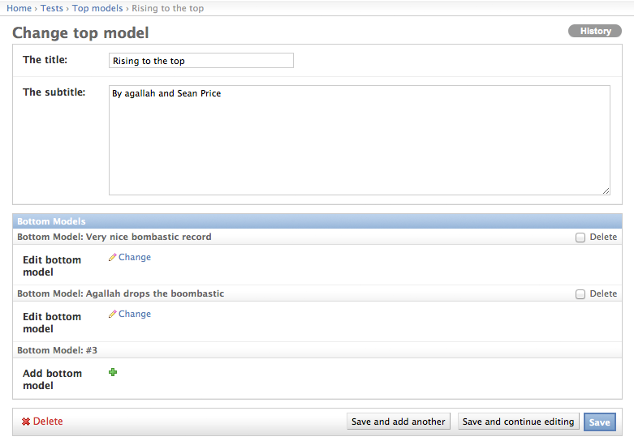

.. _tree_explanation:

Admin support for model trees with more than 2 levels of related items
======================================================================

.. note::
    
    This is the documentation for the **new** tree, which is much more flexible
    and powerful as the old one. for the old docs, see :ref:`oldtree_explanation`

Easymode has full admin support. Since content easymode was designed to handle
is heavy hierarchic, easymode can also support this in the admin.

The single most annoying problem you will encounter when building django apps,
is that after you discovered the niceties of 
:attr:`~django.contrib.admin.ModelAdmin.inlines`, you find out that only
1 level of :attr:`~django.contrib.admin.ModelAdmin.inlines`
is supported. It does not support any form of recursion.

Easymode gives you the :mod:`easymode.tree.admin` package which gives you two
baseclasses you can use to make recursive inlines possible. Django let's you define
both regular :class:`~django.contrib.admin.ModelAdmin` as well
:class:`~django.contrib.admin.StackedInline` or
:class:`~django.contrib.admin.TabularInline` for your models. But it's less known
that you can use them *at the same time*, for the same model. That is exactly what
we're going to do to implement a nice admin tree. The result will look like this:

Clicking the *Add bottom model* button will open a popup, just like with foreign keys, that can
be used to add a new item to the list. Clicking the *Change* link will move to the
edit view of the related item. This way you can nest as deep as you want.

Implementing the tree
---------------------

As said to implement a tree you've got to define both an inline model admin as
a regular modeladmin for the model you want to inline::

    class BottomAdmin(InvisibleModelAdmin):
        """
        I am using InvisibleModelAdmin as a base class here so I can get the
        parent_link functionality and also that BottomAdmin is not visible in
        the admin listing (see old tree for more info). I could've used
        LinkedItemAdmin as well, if I would've been interested in parent_link
        only. This is the change view for the inlined item.
        """
        parent_link = 'top'

    class BottomLinkInline(LinkInline):
        """
        This is the inline view of the inlined item. It will de rendered as a
        link to the change view or add view of the inlined item.
        
        NOTE that you MUST define fields, which must only include the foreign key.
        Ofcourse you might want to include some more fields and put them as
        read_only_fields, to give a bit more info.
        """
        fields = ('top',)
        model = BottomModel

Also the model that holds the inlines, needs to extend a special admin class::

    class TopAdmin(LinkedItemAdmin):
        """
        This is the top view that has the inlines. It has a special form and
        template to make it display the foreign key fields as links.
        """
        inlines = [BottomLinkInline]

That is all the code to implement one level of the tree. Note that because the
inlined items are **real** inlines, you can do all the funky stuff you used to
do with them like drag and drop reorder and such.

See :class:`easymode.tree.admin.abstract.LinkInline`,
:class:`easymode.tree.admin.abstract.LinkedItemAdmin` and 
:class:`~easymode.tree.admin.relation.InvisibleModelAdmin` for more info.